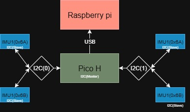

# Description
This project is made for reading and fusing multiple IMU sensor (ISM330DLCX) data for a miniature excavator model. The IMU reader uses Raspberry Pi Pico(RP2040) and communication is done through I2C. Maxiumum read frequency is 160 Hz.

 **Note:** Incomplite implementation of BNO08X-sensor reading. SPI communication doesn't work yet. Reading sensor data via I2C works only speed of 10hz. 
# Architecture
The system uses up to two I2C channels and communication is done USB. The configured I2C GPIO pins are:
* GPIO0(SDA|I2C0)
* GPIO1(SCL|I2C0)
* GPIO2(SDA|I2C1)
* GPIO3(SCL|I2C1)

The fusion part uses https://github.com/xioTechnologies/Fusion.git repository.

 The possible configurable settings are:
* Sample Rate
* Sensor count
* LPF enabled
* LPF alpha

LPF equation is: old_val*(1 - alpha) + new_val * alpha

When you power on the device it waits for the user to provide a handshake where they specify the settings for the IMU reading.  Example of how to do that is in the usb_serial_reader.py file. User input settings are collected in a global struct, accessible throughout the entire project and can be easily extended.

# Usage 
* Clone pico-sdk https://github.com/raspberrypi/pico-sdk.git
* Run `source build_and_run.sh`
* Press pico's bootsel button and put it into your USB-port.
* run `source  transfer_uf2_topico_linux.sh`
* run `python -m venv .venv`
* run `source .venv/bin/activate`
* run `pip install pyserial`
* run `sudo .venv/bin/python usb_serial_reader.py`
* provide the reading settings

# Constributors
- [Emil](https://github.com/https://github.com/Emil-Frisk)
- [Vann](https://github.com/vann1)